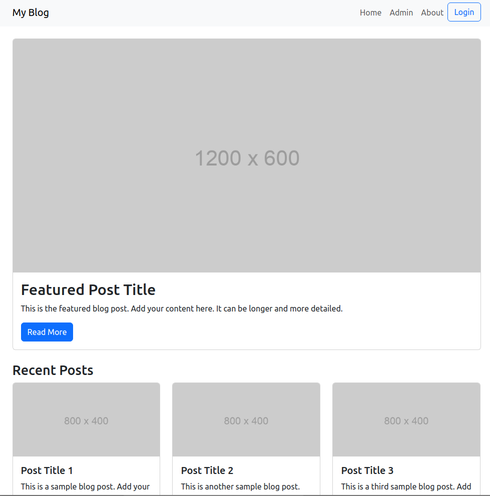
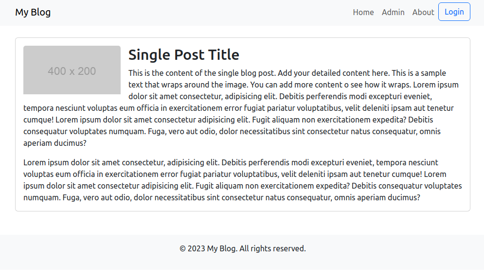
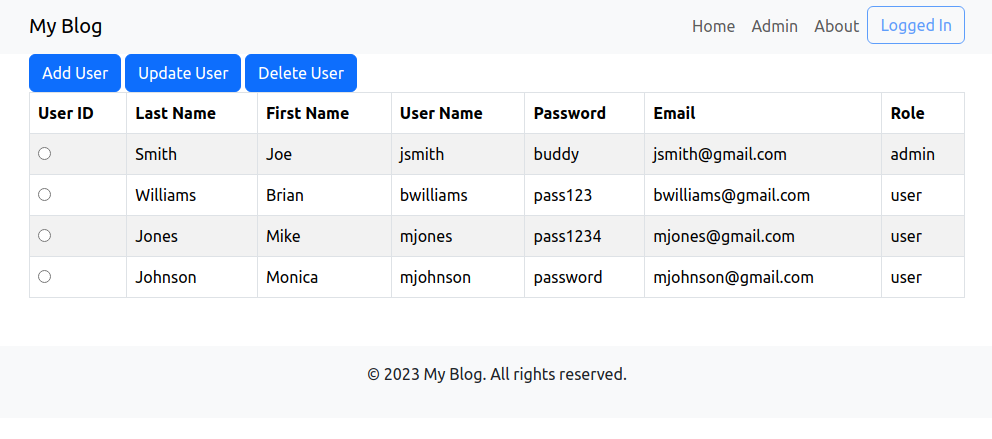

# Assignment Four: Blog Management System

In this assignment, you will be creating a system where multiple **authors** can post articles to a shared blog page.  Each of the **authors** should be able to *add new posts and update and delete their existing posts*. An **author** does not have the ability to modify any other author's posts. All of the posts can be viewed by unauthenticated users on the home, post, and about pages. **admin** users have the ability to add, update, and delete system users, and the ability to add, update, and delete any of the posts.

### Blog Home Page

### Blog Post Page

## Provided Functionality

1. A database, **blogDB**, with a users and posts table has been provided along with a SQL script for creating the database. You can modify the tables in the database if needed (Modify the SQL script and then rerun the script).

2. All of the Bootstrap page views for the home page(home.php), a single post page(post.php), an about page(about.php), and the Admin Pages(listUsers.php, userForm.php, addUser.php, and delUser.php).

3. All of the **CRUD** functionality for the Admin page to add, update, and delete **users** has been implemented.

### Blog Admin Page

## Tasks to Perform

1. Modify the home page and post page to enable users the ability to read all of the posts.

2. Add the **CRUD** functionality for the **Author** to manage **posts**. (Like Admin)

3. Implement security for security roles, **admin** and **author**.

4. Add the ability to upload an image to be displayed with the post.

